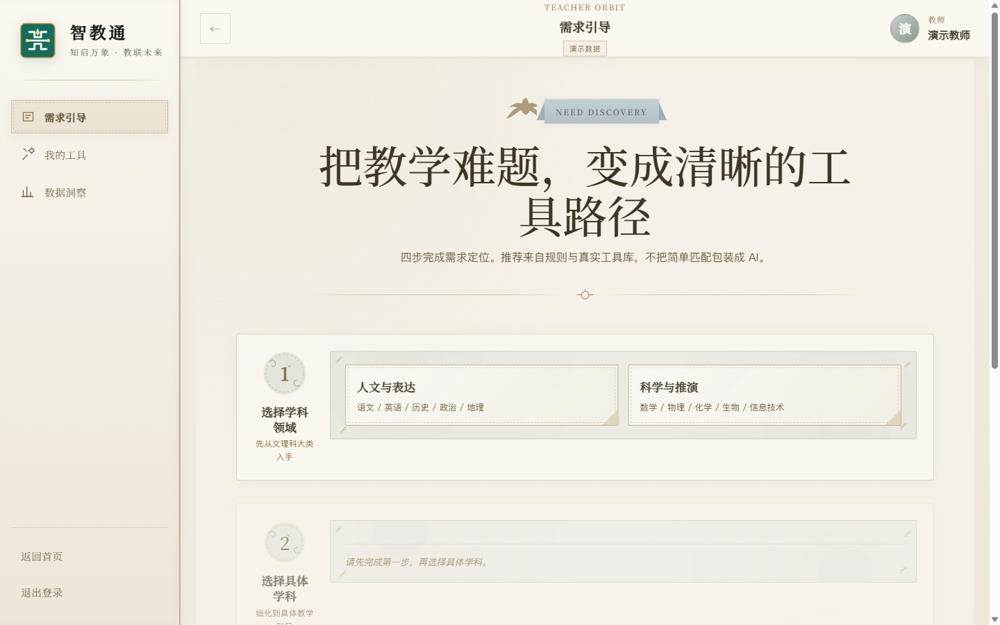
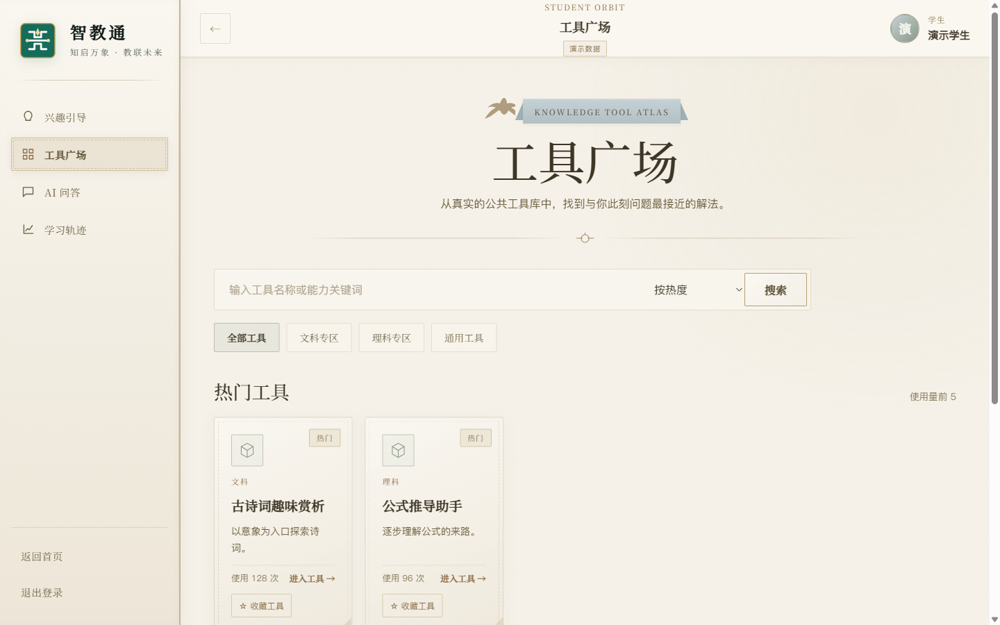
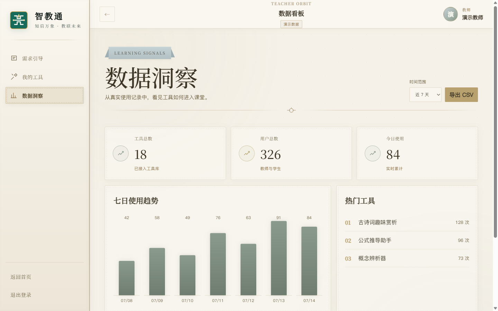
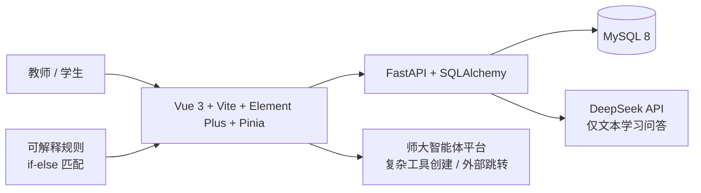

# 智教通

## AI 智能教学辅助平台

> 让每一次教学需求，都找到清晰的数字化路径。

[](https://github.com/xinyuzhang610/-/actions/workflows/ci.yml)


智教通面向教师与学生，把教学需求、数字工具、文本问答与学习记录连接起来。教师可以定位教学问题、匹配工具并查看使用信号；学生可以从兴趣出发探索工具、进行 AI 学习问答并回看自己的学习轨迹。

<p align="center">
  
</p>

## 为什么做智教通

教师面对越来越多的数字工具，却不一定知道当前教学问题需要什么、哪个工具适合当前目标、使用后产生了怎样的效果。学生知道 AI，也不一定知道如何把一个模糊问题变成可继续的学习路径。

智教通解决的不是“再增加一个工具”，而是帮助用户从“知道有 AI”走到“知道什么时候、为什么、怎样使用数字工具”。其中，工具推荐采用可解释的规则匹配；DeepSeek 仅用于文本学习问答。

## 产品闭环

```text
需求发现 → 工具匹配 → AI 问答 → 学习轨迹 → 教学洞察
```

| 环节 | 用户得到什么 |
| --- | --- |
| 需求发现 | 将学科、情境与教学目标说清楚 |
| 工具匹配 | 看到基于目标与分类的可解释匹配结果 |
| AI 问答 | 在文本对话中澄清概念、拆解问题 |
| 学习轨迹 | 留下工具使用与问题探索记录 |
| 教学洞察 | 从使用数据中观察工具如何进入课堂 |

## 两条工作路径

### 教师端

**需求定位 → 工具推荐 → 工具管理 → 使用数据洞察**

- 通过需求引导逐步定位学科与教学目标。
- 通过规则驱动的工具匹配查看推荐依据，不把简单匹配包装成 AI 推荐。
- 管理已接入工具、公开状态与分享入口。
- 在 Dashboard 中查看使用趋势、热门工具与最近记录。

### 学生端

**兴趣 / 学习引导 → 工具广场 → AI 问答 → 学习轨迹**

- 从兴趣线索进入更具体的学习方向。
- 在工具广场按分类、关键词和热度探索工具。
- 使用 DeepSeek 进行文本学习问答；复杂工具创建仍通过外部师大智能体平台完成。
- 收藏工具，并在学习记录中回看问题与回答。

## 产品界面

以下图片来自项目真实页面的 Demo Mode 本地浏览器截图，不是概念稿。截图不包含开发者工具、账号密码、API Key 或本机隐私信息。

### 教师需求引导



### 学生工具广场



### 教师数据洞察



## 核心能力

| 能力 | 说明 |
| --- | --- |
| 教学需求发现 | 用分步选择把模糊的教学难题收束为可执行目标。 |
| 可解释工具匹配 | 使用学科、分类和需求条件进行规则驱动匹配，可追溯、可审计。 |
| 双角色工作台 | 教师侧关注教学组织与数据，学生侧关注探索、问答与记录。 |
| AI 学习问答 | DeepSeek 只参与文本学习问答，帮助用户继续追问和理解。 |
| 学习轨迹沉淀 | 记录工具使用与问答过程，为后续回看提供线索。 |
| 教学数据洞察 | 汇总使用趋势、热门工具和最近记录，支持教师观察课堂信号。 |

## 系统架构



| 层 | 技术 |
| --- | --- |
| Frontend | Vue 3 / Vite / Element Plus / Pinia / Axios |
| Backend | FastAPI / SQLAlchemy / Alembic / PyMySQL |
| Database | MySQL 8.0 |
| AI | DeepSeek API，仅用于文本学习问答 |
| Engineering | Vitest / Vue Test Utils / Pytest / GitHub Actions |

## 工程质量

仓库现有 CI 覆盖前端测试与生产构建、后端 pytest，以及带 MySQL 服务的 Alembic migration validation。主分支当前 CI 状态可通过上方 Badge 查看；这里不额外声称覆盖率或性能指标。

- Frontend unit tests：`npm test -- --run`
- Production build：`npm run build`
- Backend tests：`python -m pytest`
- MySQL CI service：GitHub Actions service container
- Migration validation：`alembic upgrade head` / `alembic current`

## 快速开始

### 环境要求

- Node.js 20+
- Python 3.11+
- MySQL 8+
- Windows PowerShell（下面命令以此为例）；macOS/Linux 可按相同步骤替换路径写法

### 1. 准备后端

```powershell
cd source/backend
Copy-Item .env.development.example .env
cd ../..
uv venv --python 3.11 source/backend/.venv
uv pip install --python source/backend/.venv/Scripts/python.exe -r source/backend/requirements.txt
source/backend/.venv/Scripts/python.exe -m alembic -c source/backend/alembic.ini upgrade head
source/backend/.venv/Scripts/python.exe source/backend/seed_local_demo.py
source/backend/.venv/Scripts/python.exe -m uvicorn main:app --app-dir source/backend --host 127.0.0.1 --port 8000
```

下面命令以 Windows PowerShell 为例；macOS/Linux 请将 `Copy-Item`、环境变量和 `.venv/Scripts/python.exe` 替换为对应写法。

首次运行前，请先在 MySQL 中创建 `zjiaotong` 数据库，并将 `source/backend/.env` 中的数据库连接改为本机账号。生产升级只使用 Alembic；已有旧表的数据库请先备份并核对数据。

#### AI Provider 配置

开发和答辩备用模式默认使用 Mock，不需要外部凭据：

```dotenv
AI_PROVIDER=mock
```

需要调用真实 DeepSeek 时，在 `source/backend/.env` 中同时设置：

```dotenv
AI_PROVIDER=deepseek
DEEPSEEK_API_KEY=<真实 Key>
```

当选择 `deepseek` 但没有有效 Key 时，后端会明确返回配置错误，不会静默退回 Mock。真实 Key 只放在本地 `.env` 或受控的部署环境中，不要提交到 Git。

### 2. 启动前端

另开一个终端：

```powershell
cd source/frontend
npm ci
$env:VITE_DEMO_MODE = "false"
npm run dev
```

前端默认地址为 `http://127.0.0.1:3000`，后端存活检查为 `http://127.0.0.1:8000/api/health`，就绪检查为 `http://127.0.0.1:8000/api/readiness`，API 文档为 `http://127.0.0.1:8000/docs`。

### 3. 本地演示模式

只做前端页面演示时，在 `source/frontend` 中运行：

```powershell
$env:VITE_DEMO_MODE = "true"
npm run dev
```

演示模式提供本地演示数据，不代表生产环境，也不绕过生产鉴权。登录页会显示“答辩演示入口”，可以直接进入教师端或学生端 Demo；生产模式下这些入口不会出现。

使用后端联调时，可使用本地种子数据中的演示账号：

```text
teacher_demo / Teacher2026
student_demo / Student2026
admin_demo   / Admin2026
```

这些账号仅用于本地演示或联调，不要用于生产环境。不要将 `.env`、MySQL 密码、DeepSeek Key 或备份提交到 Git。生产环境须使用 HTTPS、Turnstile 和受限 MySQL 账号。

## 文档

- [文档索引](docs/README.md)
- [环境配置指南](docs/guides/环境配置指南.md)
- [技术栈说明](docs/guides/技术栈说明.md)
- [竞赛项目资料](docs/competition/project/)
- [竞赛最终材料](docs/competition/final/)

## 当前交付边界

- 工具广场和分享链接可公开预览；AI、收藏和学习轨迹要求学生登录。
- 工具采用软删除；广场状态、分享启用和分享过期时间独立管理。
- 公开 API 不返回提示词或内部界面配置。
- 二维码在前端本地生成，不依赖第三方二维码服务。
- 复杂智能体创建通过带白名单上下文参数的新窗口跳转师大智能体平台，不交换账号或工作流数据。

## Team

项目团队信息以项目方确认内容为准；公开仓库暂不列出未经确认的成员姓名或职责。

## License & security

提交安全问题请先阅读 [SECURITY.md](SECURITY.md)，不要在公开 Issue 中粘贴密钥、密码或用户数据。
